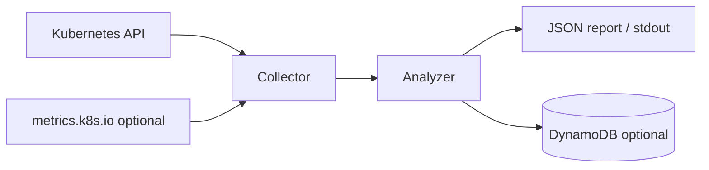

# Cluster Optimizer

Cluster Optimizer is a read-only Kubernetes cost and capacity advisor. It
collects cluster shape, workload requests, optional live usage metrics, and
disruption settings, then emits conservative recommendations that reduce waste
without silently trading away reliability, security, or operational safety.

The first deployment shape is a Kubernetes CronJob, not a DaemonSet. Cost
optimization is cluster-scoped, so a single scheduled pod can inspect the API
server with read-only RBAC. Running one pod per node would add cost and
permissions without improving the analysis.

## Product Principles

- Read-only by default. The tool recommends changes; it does not mutate
  workloads, nodes, PDBs, HPAs, or cloud resources.
- Well-Architected guardrails. Every finding includes cost impact plus
  reliability, security, operational, performance, and sustainability context.
- Evidence over guesses. Recommendations carry the observed usage, requests,
  limits, replicas, PDBs, and confidence level that produced them.
- Multi-tenant friendly. Namespaces and workload owners are first-class, and
  findings avoid cross-tenant assumptions.
- Open-source ready. Provider-specific integrations are optional modules; the
  core analyzer runs against standard Kubernetes APIs.

## Architecture



The application is intentionally small:

- `collector`: reads Kubernetes objects and metrics.
- `analyzer`: applies rules for requests, PDBs, HPA bounds, DaemonSet overhead,
  node headroom, and node-count feasibility.
- `persistence`: stores reports in DynamoDB when configured.
- `manifests`: read-only RBAC and CronJob deployment examples.

## Quick Start

Run locally against your active kubeconfig:

```bash
go run ./cmd/cluster-optimizer --output text
```

Build and publish the image:

```bash
docker build -t ghcr.io/gipsychef/cluster-optimizer:0.1.0 .
docker push ghcr.io/gipsychef/cluster-optimizer:0.1.0
```

Run in-cluster without persistence:

```bash
kubectl apply -f manifests/rbac.yaml
kubectl apply -f manifests/cronjob.yaml
```

This mode writes each report to the Kubernetes job logs. It is useful for
ad-hoc checks, but it cannot calculate multi-day history.

Trigger a one-off run:

```bash
kubectl create job -n cluster-optimizer --from=cronjob/cluster-optimizer cluster-optimizer-manual
kubectl logs -n cluster-optimizer job/cluster-optimizer-manual
```

## DynamoDB Persistence

DynamoDB is optional for a single report and recommended for continuous cost
optimization. Historical data is what lets the optimizer distinguish idle
capacity from short-lived quiet periods before recommending lower requests.

Create the table:

```bash
aws cloudformation deploy \
  --stack-name cluster-optimizer-dynamodb \
  --template-file infra/cloudformation/dynamodb-table.yaml \
  --parameter-overrides TableName=cluster-optimizer-reports
```

Create the least-privilege DynamoDB writer policy:

```bash
aws cloudformation deploy \
  --stack-name cluster-optimizer-dynamodb-writer-policy \
  --template-file infra/cloudformation/dynamodb-writer-policy.yaml \
  --parameter-overrides TableName=cluster-optimizer-reports \
  --capabilities CAPABILITY_NAMED_IAM
```

For a non-AWS Kubernetes cluster such as DOKS, attach that managed policy to an
IAM principal and provide its access key as a Kubernetes Secret:

```bash
aws iam create-user --user-name cluster-optimizer-doks
aws iam attach-user-policy \
  --user-name cluster-optimizer-doks \
  --policy-arn <managed-policy-arn>
aws iam create-access-key --user-name cluster-optimizer-doks
```

Create the Kubernetes namespace, ServiceAccount, and read-only RBAC:

```bash
kubectl apply -f manifests/rbac.yaml
```

Create the Kubernetes Secret from the access key values returned by AWS:

```bash
kubectl create secret generic cluster-optimizer-aws \
  -n cluster-optimizer \
  --from-literal=AWS_ACCESS_KEY_ID=<access-key-id> \
  --from-literal=AWS_SECRET_ACCESS_KEY=<secret-access-key> \
  --from-literal=AWS_REGION=<aws-region>
```

Deploy the DynamoDB-enabled CronJob:

```bash
kubectl apply -f examples/cronjob-dynamodb.yaml
```

Without `DYNAMODB_TABLE`, the optimizer writes the report to stdout only.
With `DYNAMODB_TABLE`, it writes the same report to DynamoDB after printing it.

## DynamoDB Model

One table is enough for the first version:

- Partition key: `pk` (`CLUSTER#<cluster_id>`)
- Sort key: `sk` (`REPORT#<iso8601_timestamp>`)
- Optional TTL attribute: `expires_at`

The stored item includes the report summary and findings as JSON-compatible
maps. This keeps the data model portable while still enabling time-series
queries per cluster.

## Current Scope

Implemented checks:

- Cluster allocatable/requested CPU and memory.
- Workloads using more memory than they request.
- Workloads that appear materially over-requested.
- Single-replica PDBs that block voluntary drains.
- PDBs that allow all replicas to be disrupted.
- HPAs where `minReplicas == maxReplicas`.
- CPU HPAs with missing CPU requests.
- DaemonSet per-node overhead.
- Two-node feasibility estimate for current node shape.

Non-goals for the first release:

- Automatic patching or node scaling.
- Provider billing ingestion.
- Long-horizon percentile analysis without a persistence backend.
- Mutating admission webhooks or policy enforcement.

## Runtime Budget

The optimizer should stay materially smaller than the workloads it advises.
The default CronJob requests `20m` CPU and `64Mi` memory with a `100m` /
`128Mi` limit. If a cluster is large enough to need more, tune the job rather
than deploying it as a DaemonSet.
