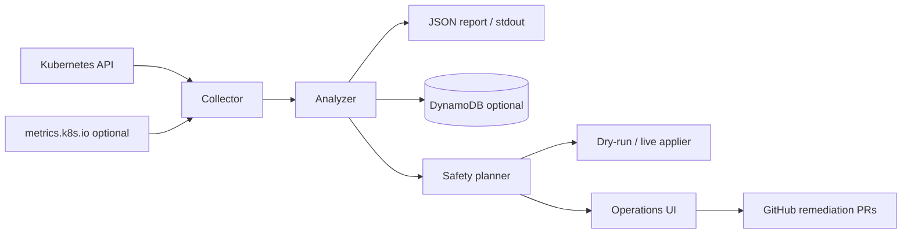

# Cluster Optimizer

> **Find — and safely fix — Kubernetes resource waste.** Built for platform and
> SRE teams, advisory by default, with tightly gated, reversible opt-in
> remediation — so you can cut spend without risking reliability. No agents on
> every node, no mutating webhooks, no surprises.

[](https://github.com/ryabinski-labs/cluster-optimizer/actions/workflows/ci.yml)
[](./LICENSE)
[](https://go.dev/)
[](#project-status)

Cluster Optimizer is a guardrailed Kubernetes cost-and-capacity engine. It reads
your cluster shape, workload requests, optional live usage metrics, and
disruption settings, then turns that evidence into recommendations, dry-run
plans, GitHub pull requests, and — only when you opt in — narrow live fixes.

A normal run is **read-only** and tells you what is wasting capacity and why.
When you choose to act, it can lower safe over-requests, open manifest
remediation PRs, write runtime-modernization instructions, and nudge relocatable
pods off a drainable node. Every mutating path is narrow, auditable, reversible,
and behind explicit operator gates.

It deploys as a single scheduled **CronJob**, not a DaemonSet. Cost optimization
is cluster-scoped, so one pod with a small service account can inspect the API
server. A pod per node would add cost and permissions without improving the
analysis.

## At a glance

| | |
| --- | --- |
| **What it is** | A Kubernetes cost & capacity optimizer (CLI + CronJob + local UI) |
| **What it does** | Flags over/under-requested workloads, risky PDBs/HPAs, DaemonSet overhead, and node-count feasibility |
| **Default mode** | Read-only analysis and dry-run plans — nothing is changed |
| **Opt-in** | Capped live request trimming, manifest PRs, rewrite-planning PRs, node consolidation nudges |
| **Safety** | Allowlists, recurrence checks, confidence floors, trim caps, and a global halt switch |
| **Runs on** | Any standard Kubernetes cluster (built and tested against DOKS) |
| **License** | Apache 2.0 |

## Who it's for

- **Platform / DevOps / SRE teams** running multi-tenant Kubernetes who want to
  cut spend without risking reliability.
- **Engineers reviewing resource requests** who want evidence (observed usage vs.
  requests, replica counts, PDB/HPA state) instead of guesses.
- **Cost-conscious teams on managed Kubernetes** (e.g. DigitalOcean DOKS, EKS,
  GKE) looking for safe, reviewable rightsizing rather than aggressive autoscaling.

If you want a tool that *recommends first* and only acts behind explicit gates,
this is built for you.

## See it run

A read-only run against your current kubeconfig prints what's wasting capacity
and why:

```text
$ go run ./cmd/cluster-optimizer --output text

Cluster: prod-blr1
Generated: 2026-05-29T14:02:11Z

Summary:
- node_count: 4
- instance_types: [s-4vcpu-8gb]
- active_pods: 37
- allocatable_cpu_m: 12000
- requested_cpu_m: 4150
- observed_cpu_m: 1820
- requested_memory_mib: 9472
- observed_memory_mib: 4060
- two_node_estimate: map[feasible:true projected_cpu_m:3900 projected_memory_mib:7100]

Findings:
- [medium] default/api cpu-request-over-provisioned: Lower CPU request toward observed usage.
  Evidence: requests 500m, observed ~120m across 3 replicas
  Risk: low — 50% trim cap and 10m floor enforced; change is reversible
- [low] default/worker fixed-replica-capacity-without-autoscaler: Consider an HPA/KEDA scaler.
  Evidence: 3 fixed replicas, observed ~40m CPU per replica, no HPA
  Risk: low — advisory only, no automatic change
```

Add DynamoDB and the local UI to track these findings over time and unlock gated
remediation — see [Quick Start](#quick-start).

## Is this the right tool?

**Use this when you want to:**

- Right-size CPU/memory requests with evidence and a safe, reversible change path.
- Catch reliability foot-guns — missing/over-permissive PDBs, `min == max` HPAs,
  CPU HPAs without CPU requests — alongside cost findings.
- Keep humans in the loop via dry-run plans and pull requests before anything merges.
- Run cost analysis on a schedule with a tiny footprint and least-privilege RBAC.

**Not a fit when you want:**

- Fully autonomous, unattended rightsizing with no review step.
- Direct cloud-provider node deletion or node-pool resizing (out of scope).
- A mutating admission webhook or in-line policy enforcement.
- Provider billing ingestion or long-horizon percentile analysis without a
  persistence backend.

For the precise list of implemented checks and non-goals, see [Current Scope](#current-scope).

## Project Status

Cluster Optimizer is early-stage software with a working analyzer, CronJob
deployment, optional DynamoDB persistence, local operations UI, GitHub
remediation workflows, opt-in live request trimming, and opt-in live node
nudging. The recommendation set is intentionally conservative and should be
reviewed before changes are applied to production workloads.

The default behavior is still advisory findings plus dry-run plans. Live
in-cluster remediation requires explicit opt-in through independent gates, a
remediation allowlist, persistence-backed recurrence checks, and a halt switch.

## What it does today

| Capability | Shipped behavior | Default mode |
| --- | --- | --- |
| Cluster analysis | Reads nodes, pods, workloads, HPAs, PDBs, metrics, DaemonSet overhead, and cluster fit. | Read-only |
| Cost recommendations | Flags over-requests, under-requests, blocked drains, HPA sensitivity, PDB issues, fixed replica capacity, runtime modernization candidates, and two-node feasibility. | Advisory |
| Trend history | Stores reports and recommendation occurrence counts in DynamoDB when configured. | Optional |
| Operations UI | Shows reports, multi-day trends, remediation readiness, engine mode, halt status, and recent remediation activity. | Local UI |
| Live request trimming | Patches CPU or memory requests on allowlisted Deployments, DaemonSets, and StatefulSets when all safety gates pass. | Off |
| Active nudging | Finds a node whose relocatable pods fit elsewhere, checks PDB headroom, then can cordon and evict to encourage consolidation. | Dry-run |
| PR-based remediation | Dispatches GitHub Actions that create manifest PRs for supported `api.yml` changes. | Opt-in |
| Rewrite planning | Creates coding-agent instruction PRs for persistent runtime modernization candidates. | Opt-in |
| Emergency stop | Shared halt ConfigMap stops live applier and live nudger without redeploying. | Available |

## Product Principles

- Advisory by default. Read-only collection and dry-run plans are the normal
  path; live mutation requires explicit opt-in, allowlisted targets, recurrence
  evidence, and a halt check.
- Well-Architected guardrails. Every finding includes cost impact plus
  reliability, security, operational, performance, and sustainability context.
- Evidence over guesses. Recommendations carry the observed usage, requests,
  limits, replicas, PDBs, and confidence level that produced them.
- Small blast radius. Live request trimming is capped, floors are enforced, and
  only one workload change is planned per CronJob tick.
- PRs before broad automation. Manifest edits and runtime modernization plans
  can be reviewed in application repositories before owners merge them.
- Multi-tenant friendly. Namespaces and workload owners are first-class, and
  findings avoid cross-tenant assumptions.
- Open-source ready. Provider-specific integrations are optional modules; the
  core analyzer runs against standard Kubernetes APIs.

## Architecture



The application is intentionally small:

- `collector`: reads Kubernetes objects and metrics.
- `analyzer`: applies rules for requests, PDBs, HPA bounds, DaemonSet overhead,
  node headroom, and node-count feasibility.
- `planner`: converts eligible findings into bounded, auditable actions.
- `applier`: dry-runs or patches safe request trims when both live gates are
  enabled.
- `nudger`: dry-runs or performs cordon-and-evict consolidation passes.
- `podgc`: dry-runs or deletes completed (Succeeded/Failed) pods left by Jobs.
- `ui`: shows trends, engine status, halt controls, readiness, and remediation
  activity from DynamoDB.
- `persistence`: stores reports, recommendation rollups, engine status, and
  remediation events in DynamoDB when configured.
- `remediators`: create GitHub PRs for supported manifest changes and rewrite
  planning instructions.
- `manifests`: base RBAC/CronJob examples plus optional applier RBAC.

## Quick Start

Run locally against your active kubeconfig:

```bash
go run ./cmd/cluster-optimizer --output text
```

Run the local DynamoDB-backed UI:

```bash
./scripts/start-ui.sh
```

Then open `http://127.0.0.1:8088`. The UI uses the default AWS credential
chain, so `AWS_PROFILE=default` or your normal default profile works. The UI
also calculates multi-report trends from DynamoDB and keeps remediation actions
disabled until a recommendation has persisted for the configured observation
window, which defaults to three days.

Build and publish the image:

```bash
docker build -t ghcr.io/ryabinski-labs/cluster-optimizer:0.1.0 .
docker push ghcr.io/ryabinski-labs/cluster-optimizer:0.1.0
```

Run in-cluster without persistence:

```bash
scripts/apply-rbac.sh
kubectl apply -f manifests/cronjob.yaml
```

This mode writes each report to the Kubernetes job logs. It is useful for
ad-hoc checks, but it cannot calculate multi-day history.

Trigger a one-off run:

```bash
kubectl create job -n cluster-optimizer --from=cronjob/cluster-optimizer cluster-optimizer-manual
kubectl logs -n cluster-optimizer job/cluster-optimizer-manual
```

## Live Auto-Apply (opt-in)

By default the optimizer is advisory and produces a dry-run plan. To let it
actually lower workload requests in-cluster you must:

1. Apply the extra RBAC manifest (`manifests/rbac-applier.yaml`), which grants
   only the `patch` verb on `apps/deployments`, `apps/daemonsets`, and
   `apps/statefulsets` in the `default` namespace, plus a single-resource `get`
   on the halt ConfigMap.
2. Set `CLUSTER_OPTIMIZER_AUTOAPPLY=true` in the CronJob's environment.
3. Pass `--auto-apply` in the container args.

Both the env var and the flag must be present. Either alone keeps the
applier in dry-run mode.

The applier refuses to mutate when any of the following apply:
- The workload is provider-managed (DOKS DaemonSets such as `kube-proxy`,
  `cilium`, `csi-do-node`, `do-node-agent`, `coredns`, `metrics-server`,
  `konnectivity-agent`, `hubble-relay`/`hubble-ui`, `cpc-bridge-proxy`,
  `doks-telemetry-config-reloader`).
- The finding is not in `config/remediation-targets.json` with that rule
  listed in `supported_rules`.
- The finding's confidence is below `high`.
- The finding has not appeared in at least 3 consecutive runs (requires
  DynamoDB persistence; the applier refuses without it).
- A safe trim is not available within the 50% max-trim cap and 10m/32Mi
  floor.
- The halt ConfigMap (`cluster-optimizer/cluster-optimizer-halt`, key
  `halt=true`) is set, or its read fails.

### Halt switch

Stop the applier, the nudger, and the completed-pod GC from making any further
changes without redeploying:

```bash
kubectl -n cluster-optimizer create configmap cluster-optimizer-halt \
  --from-literal=halt=true \
  --dry-run=client -o yaml | kubectl apply -f -
```

Reverse with `halt=false` or by deleting the ConfigMap.

### Nudger

The nudger (`--nudge` / `CLUSTER_OPTIMIZER_NUDGE=true`) reports which node
could be emptied next. It is dry-run by default; set
`CLUSTER_OPTIMIZER_NUDGE_LIVE=true` to actually cordon the selected node and
evict relocatable pods. It checks the halt switch and aborts when any candidate
eviction is blocked by a PDB with `DisruptionsAllowed=0`.

### Completed-pod cleanup

Clusters that run many Jobs/CronJobs accumulate completed pods (phase
`Succeeded` or `Failed`) that linger long after they finish. They burn no
CPU/memory but clutter `kubectl get pods`, count against the per-node pod cap,
and hold IP allocations. The pod GC (`--gc-completed-pods` /
`CLUSTER_OPTIMIZER_GC_COMPLETED_PODS=true`) deletes them. It is dry-run by
default; set `CLUSTER_OPTIMIZER_GC_COMPLETED_PODS_LIVE=true` to actually delete,
and it honours the shared halt switch.

Flags / environment variables:

| Flag | Env | Default | Purpose |
| --- | --- | --- | --- |
| `--gc-completed-pods` | `CLUSTER_OPTIMIZER_GC_COMPLETED_PODS` | `false` | Enable the cleanup pass (dry-run unless the live gate is set). |
| _(live gate)_ | `CLUSTER_OPTIMIZER_GC_COMPLETED_PODS_LIVE` | `false` | Actually delete; otherwise log only. |
| `--gc-namespace` | `CLUSTER_OPTIMIZER_GC_NAMESPACE` | _(all)_ | Restrict to one namespace. |
| `--gc-min-age` | `CLUSTER_OPTIMIZER_GC_MIN_AGE` | `0` | Only delete pods that finished at least this long ago (e.g. `1h`). |
| `--gc-max-deletions` | `CLUSTER_OPTIMIZER_GC_MAX_DELETIONS` | `0` | Cap deletions per run, oldest first (`0` = no cap). |

### Recovery and operator runbook

See [`docs/runbook.md`](docs/runbook.md) for:

- Activating the halt switch.
- Rolling back a single workload patch.
- Uncordoning a node, suspending the CronJob, revoking applier RBAC.
- "Did the optimizer cause this incident?" checklist.
- The full list of things the optimizer will never do on its own.

## DynamoDB Persistence

DynamoDB is optional for a single report and recommended for continuous cost
optimization. Historical data is what lets the optimizer distinguish idle
capacity from short-lived quiet periods before recommending lower requests.

Create the table:

```bash
aws cloudformation deploy \
  --stack-name cluster-optimizer-dynamodb \
  --template-file infra/cloudformation/dynamodb-table.yaml \
  --parameter-overrides TableName=cluster-optimizer-reports
```

Create the least-privilege DynamoDB writer policy:

```bash
aws cloudformation deploy \
  --stack-name cluster-optimizer-dynamodb-writer-policy \
  --template-file infra/cloudformation/dynamodb-writer-policy.yaml \
  --parameter-overrides TableName=cluster-optimizer-reports \
  --capabilities CAPABILITY_NAMED_IAM
```

For a non-AWS Kubernetes cluster such as DOKS, attach that managed policy to an
IAM principal and provide its access key as a Kubernetes Secret:

```bash
aws iam create-user --user-name cluster-optimizer-doks
aws iam attach-user-policy \
  --user-name cluster-optimizer-doks \
  --policy-arn <managed-policy-arn>
aws iam create-access-key --user-name cluster-optimizer-doks
```

Create the Kubernetes namespace, ServiceAccount, and base RBAC:

```bash
scripts/apply-rbac.sh
```

Create the Kubernetes Secret from the access key values returned by AWS:

```bash
kubectl create secret generic cluster-optimizer-aws \
  -n cluster-optimizer \
  --from-literal=AWS_ACCESS_KEY_ID=<access-key-id> \
  --from-literal=AWS_SECRET_ACCESS_KEY=<secret-access-key> \
  --from-literal=AWS_REGION=<aws-region>
```

Deploy the DynamoDB-enabled CronJob example:

```bash
kubectl apply -f examples/cronjob-dynamodb.yaml
```

That example is configured for the full remediation engine (`--auto-apply` and
`--nudge` plus their live environment gates). For history-only advisory runs,
start from `manifests/cronjob.yaml`, add only `DYNAMODB_TABLE` and AWS
credentials, and leave the live gates commented out.

Without `DYNAMODB_TABLE`, the optimizer writes the report to stdout only.
With `DYNAMODB_TABLE`, it writes the same report to DynamoDB after printing it.

## GitHub Actions Deployment

The repository includes GitHub-hosted-runner workflows for CI, image publishing,
AWS infrastructure, Kubernetes deployment, and opt-in remediation pull requests:

- `.github/workflows/ci.yml`: runs `go mod tidy`, `go test ./...`, and
  `go vet ./...`.
- `.github/workflows/publish-image.yml`: builds and pushes
  `ghcr.io/ryabinski-labs/cluster-optimizer`.
- `.github/workflows/deploy-infra.yml`: deploys the DynamoDB table and the
  DynamoDB writer IAM policy.
- `.github/workflows/deploy-kubernetes.yml`: deploys the Kubernetes RBAC,
  optional AWS Secret, and CronJob.
- `.github/workflows/remediate-api-yml.yml`: creates a pull request against an
  application repository for supported api.yml changes after the UI dispatches
  an approved remediation.
- `.github/workflows/generate-rewrite-instructions.yml`: creates a planning PR
  in an application repository with `instructions.md` for runtime
  modernization recommendations such as Go rewrites.

All jobs use GitHub-managed `ubuntu-latest` runners. Workflows install Go with
`actions/setup-go`; Docker and GitHub CLI are available on the hosted runner;
the Kubernetes deployment workflow installs `kubectl`.

Repository variables:

- `AWS_REGION`: AWS region used by the infrastructure workflow.
- `AWS_ROLE_TO_ASSUME`: AWS IAM role ARN assumed by the infrastructure workflow
  through GitHub Actions OIDC. The example role template is
  `infra/cloudformation/github-actions-deploy-role.yaml`.

Repository secrets:

- `DOKS_KUBECONFIG_B64`: optional base64-encoded kubeconfig for the target DOKS
  cluster. Hosted runners do not have a pre-existing kubeconfig, so set this
  secret before running `.github/workflows/deploy-kubernetes.yml`.
- `CLUSTER_OPTIMIZER_AWS_ACCESS_KEY_ID`: runtime access key for the
  in-cluster optimizer when DynamoDB persistence is enabled.
- `CLUSTER_OPTIMIZER_AWS_SECRET_ACCESS_KEY`: matching runtime secret key.
- `GHCR_PULL_TOKEN`: optional GitHub token with package read access. Set this
  only if the GHCR package is private.
- `REMEDIATION_GITHUB_TOKEN`: GitHub token that can checkout, push branches to,
  and create pull requests in target application repositories such as
  `ryabinski-labs/echothread`.

Create the kubeconfig secret only when the runner does not already have cluster
access:

```bash
base64 -i ~/.kube/config | gh secret set DOKS_KUBECONFIG_B64
```

For DynamoDB persistence, create the runtime IAM user/access key as described
above and store the values:

```bash
gh secret set CLUSTER_OPTIMIZER_AWS_ACCESS_KEY_ID
gh secret set CLUSTER_OPTIMIZER_AWS_SECRET_ACCESS_KEY
gh variable set AWS_REGION --body us-east-1
```

Run order:

1. `CI`
2. `Publish Image`
3. `Deploy AWS Infra`
4. `Deploy Kubernetes`

For normal Kubernetes deploys from a local shell, prefer the wrapper script
over direct `kubectl apply`. It triggers the same GitHub Actions workflow. By
default it deploys the latest successful image built by the `Publish Image`
workflow on `main`:

```bash
./scripts/deploy-kubernetes.sh --wait
```

For rollbacks or exact deploys, pass an immutable image tag explicitly:

```bash
./scripts/deploy-kubernetes.sh <published-image-tag> --wait
```

Verify the live CronJob is pinned to the latest published image and can execute
in-cluster:

```bash
./scripts/verify-deployment.sh --run-job
```

## Remediation Workflow

Remediation remains opt-in. The local UI shows recurring recommendation trends,
engine mode, halt status, and recent remediation activity. The `Remediate`
button is disabled until the same workload/rule has been seen for at least
`MIN_REMEDIATION_DAYS` days. The default is `3`.

Supported first-pass remediations are intentionally narrow:

- CPU request tuning in `api.yml`.
- Memory request tuning in `api.yml`.
- Single-replica PDB drain fixes in `api.yml`.
- HPA scale-up and scale-down stabilization tuning in `api.yml` for
  percentage-based CPU autoscalers whose low requests are sensitive to request
  tuning. The patch only raises stabilization windows; it does not change the
  CPU target or request.
- Runtime modernization planning for persistent rewrite candidates. This
  creates a coding-agent instructions file, not implementation code.

### Rule values for `supported_rules`

Each target lists the rules it opts in to under `supported_rules`. Only the
rules below have a remediation pipeline; listing any other rule has no effect.
Each rule also requires specific target fields to be set — listing a rule
without those fields leaves the UI in "remediation not available" state.

| Rule ID                              | Remediation kind                 | Required target fields                                |
| ------------------------------------ | -------------------------------- | ----------------------------------------------------- |
| `memory-request-over-provisioned`    | live trim + api.yml PR patch     | `container` (live), `manifest_path` (PR)              |
| `cpu-request-over-provisioned`       | live trim + api.yml PR patch     | `container` (live), `manifest_path` (PR)              |
| `memory-request-below-usage`         | api.yml PR patch                 | `container`, `manifest_path`                          |
| `single-replica-pdb-blocks-drain`    | api.yml PR patch                 | `manifest_path`                                       |
| `cpu-hpa-low-request-sensitive`      | api.yml PR patch                 | `manifest_path`                                       |
| `runtime-modernization-candidate`    | rewrite-instructions PR          | `repository`, `instructions_path`                     |

All other analyzer rules (`cpu-hpa-without-cpu-request`,
`daemonset-overhead-limits-small-node-efficiency`,
`fixed-replica-capacity-without-autoscaler`, `hpa-min-equals-max`,
`missing-pdb-for-multi-replica-workload`, `pdb-allows-full-disruption`,
`pdb-max-unavailable-zero`) are advisory-only today. They surface in reports
but have no remediation workflow, so listing them in `supported_rules` does
nothing.

Provider-managed workloads (DOKS-reconciled DaemonSets/Deployments such as
`coredns`, `metrics-server`, `kube-proxy`, `cilium`, `csi-do-node`, and the
entire `kube-system`, `kube-public`, `kube-node-lease`, and
`cluster-optimizer` namespaces) are filtered out by the classifier before any
remediation check runs. Adding entries for them in `remediation-targets.json`
has no effect — they cannot be live-mutated or PR-remediated by this tool.

Workloads must be mapped before the button can become available. The file `config/remediation-targets.json` is ignored by Git to protect your private configuration and repository names. 

To set up your mappings, copy the public-safe example configuration file to `config/remediation-targets.json`:

```bash
cp config/remediation-targets.example.json config/remediation-targets.json
```

Then edit `config/remediation-targets.json` to point a Kubernetes workload at its application repository, manifest path, instructions path, and container name. When clicked, the UI dispatches either `.github/workflows/remediate-api-yml.yml`
for manifest changes or `.github/workflows/generate-rewrite-instructions.yml`
for runtime modernization planning.

The local UI loads this file once at process start, so restart the UI
process to pick up edits.

### Deploying targets to the in-cluster CronJob

The in-cluster CronJob mounts the targets file from a ConfigMap named
`cluster-optimizer-targets` in the `cluster-optimizer` namespace (see
`examples/cronjob-dynamodb.yaml`). Because `config/remediation-targets.json`
is gitignored, the `Deploy Kubernetes` workflow cannot ship it for you —
upload it from a workstation with kubectl pointed at the cluster:

```bash
# Preview the generated ConfigMap without touching the cluster
scripts/deploy-remediation-targets.sh --dry-run

# Apply the ConfigMap
scripts/deploy-remediation-targets.sh

# Apply, then create a one-off Job from the CronJob template
# so the next analyzer run uses the new targets immediately
scripts/deploy-remediation-targets.sh --trigger-job
```

The script is idempotent: it builds the ConfigMap client-side with
`kubectl create configmap --dry-run=client -o yaml` and pipes the result
through `kubectl apply -f -`. Override `TARGETS_FILE`, `TARGETS_NAMESPACE`,
`TARGETS_CONFIGMAP`, `TARGETS_KEY`, or `KUBECTL` via environment if your
deployment differs from the defaults. The CronJob picks up the new
ConfigMap on its next scheduled run.

Rewrite planning PRs create a detailed `instructions.md` for a coding agent.
The file includes the observed cluster evidence, performance-engineering
baseline requirements, architecture constraints, implementation guardrails,
deep QA requirements, rollout and rollback expectations, and acceptance
criteria. These PRs are planning-only; implementation should happen in a
separate reviewed branch after profiling and owner approval.

For local UI dispatch, either export `GITHUB_TOKEN` / `GH_TOKEN` or authenticate
the GitHub CLI with `gh auth login`. The in-repository workflow still needs
`REMEDIATION_GITHUB_TOKEN` as a repository secret so the hosted runner can
create PRs in the application repositories.

## DynamoDB Model

One table is enough for the first version:

- Partition key: `pk` (`CLUSTER#<cluster_id>`)
- Sort key: `sk` (`REPORT#<iso8601_timestamp>`)
- Optional TTL attribute: `expires_at`

The stored item includes the report summary and findings as JSON-compatible
maps. This keeps the data model portable while still enabling time-series
queries per cluster.

## Current Scope

Implemented checks:

- Cluster allocatable/requested CPU and memory.
- Workloads using more memory than they request.
- Workloads that appear materially over-requested.
- Runtime modernization candidates where profiling a rewrite to Go/Rust, or a
  more elastic worker model, could reduce always-on memory cost.
- Fixed replica capacity without HPA/KEDA evidence.
- Single-replica PDBs that block voluntary drains.
- Missing PDBs for multi-replica workloads.
- PDBs that allow all replicas to be disrupted.
- HPAs where `minReplicas == maxReplicas`.
- CPU HPAs with missing CPU requests.
- Percentage-based CPU HPAs whose low per-replica requests make scale-up
  sensitive to request tuning.
- DaemonSet per-node overhead.
- cert-manager HTTP-01 solver hygiene.
- Two-node feasibility estimate for current node shape.

Current non-goals:

- Live mutation by default.
- Unbounded automatic patching.
- Direct cloud-provider node deletion or node-pool resizing.
- Provider billing ingestion.
- Long-horizon percentile analysis without a persistence backend.
- Mutating admission webhooks or policy enforcement.

## Runtime Budget

The optimizer should stay materially smaller than the workloads it advises.
The default CronJob requests `20m` CPU and `64Mi` memory with a `100m` /
`128Mi` limit. If a cluster is large enough to need more, tune the job rather
than deploying it as a DaemonSet.

## Related projects

Cluster Optimizer is the Kubernetes-rightsizing piece of a small, cost-first
toolkit. The other two are useful at different layers of the same bill:

- [Tovin.io](https://tovin.io/?utm_source=cluster-optimizer&utm_medium=referral&utm_campaign=finops-cluster) —
  a multi-cloud cost monitor (AWS, GCP, DigitalOcean) with project-level
  allocation and anomaly alerts. Cluster Optimizer tells you which workloads
  are over-requested; Tovin.io shows where that spend lands across the whole
  estate.
- [Steada](https://steada.dev/?utm_source=cluster-optimizer&utm_medium=referral&utm_campaign=finops-cluster) —
  cost-first managed Valkey (Redis-compatible) priced on capacity instead of
  per command, for steady cache, rate-limit, and session workloads.

## Support

Support is best-effort through GitHub issues. Do not include credentials,
kubeconfigs, private cluster reports, or customer data in public issues. See
[SUPPORT.md](./SUPPORT.md) and [SECURITY.md](./SECURITY.md) for support and
vulnerability reporting boundaries.

## License

Cluster Optimizer is licensed under the Apache License 2.0. See
[LICENSE](./LICENSE).
